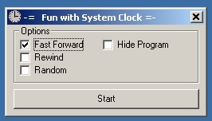

<div align="center">

## Fun with Clock


</div>

### Description

A humourous program which rapidly alters System Time/Date via API to produce amusing effect on Traybar Clock. Settings Fast Forward / Rewind / or Random.

Tested only on WinXP, may require administator rights in some OS's. Restoring the correct time/date after using this is your job.

Disclaimer -

Many portions of the operating system and 3rd party programs rely on system time to function correctly. Setting an invalid Time/Date might even cause computer to reboot. The author is not responsible for any damages that this program may cause. My intention is to demonstrate an amusing effect on Traybar Clock.
 
### More Info
 
Many portions of the operating system and 3rd party programs rely on system time to function correctly. Setting an invalid Time/Date might even cause computer to reboot. The author is not responsible for any damages that this program may cause. My intention is to demonstrate an amusing effect on Traybar Clock.


<span>             |<span>
---                |---
**Submitted On**   |2003-12-31 20:09:16
**By**             |[C\. Trizzle](https://github.com/Planet-Source-Code/PSCIndex/blob/master/ByAuthor/c-trizzle.md)
**Level**          |Beginner
**User Rating**    |5.0 (10 globes from 2 users)
**Compatibility**  |VB 6\.0
**Category**       |[Jokes/ Humor](https://github.com/Planet-Source-Code/PSCIndex/blob/master/ByCategory/jokes-humor__1-40.md)
**World**          |[Visual Basic](https://github.com/Planet-Source-Code/PSCIndex/blob/master/ByWorld/visual-basic.md)
**Archive File**   |[Fun\_with\_C1759456192004\.zip](https://github.com/Planet-Source-Code/c-trizzle-fun-with-clock__1-54487/archive/master.zip)

### API Declarations

```
Private Declare Function SetSystemTime Lib "kernel32" (lpSystemTime As SYSTEMTIME) As Long
Private Declare Function RegisterHotKey Lib "user32" (ByVal hWnd As Long, ByVal id As Long, ByVal fsModifiers As Long, ByVal vk As Long) As Long
Private Declare Function UnregisterHotKey Lib "user32" (ByVal hWnd As Long, ByVal id As Long) As Long
Private Declare Function PeekMessage Lib "user32" Alias "PeekMessageA" (lpMsg As Msg, ByVal hWnd As Long, ByVal wMsgFilterMin As Long, ByVal wMsgFilterMax As Long, ByVal wRemoveMsg As Long) As Long
Private Declare Function WaitMessage Lib "user32" () As Long
```


